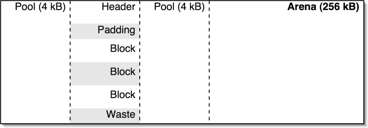

eSLIDE
# Symptôme

* Prends plus de RAM que nécessaire
* Prende de plus en plus de RAM

!SLIDE
# Memory leaks

* "Vrai" : couche basse
* "Faux" : cache non effacé, mauvaise structure de données

!SLIDE
# Trés difficile à déterminer

Pas d'outil pour profiler la mémoire (Python & C)

!SLIDE scale
# top

Utilisation RAM vs charge machine


!SLIDE scale
# Fonctionnement de la RAM

La RAM découpée en page, accessible avec des «page table»

http://solid-angle.blogspot.ca/2011/02/virtual-addressing-101.html


!SLIDE
# Pourquoi une indirection ?

- Trop lourd à gérer
- Permet d'allouer de la mémoire non contigu (ou différente)
- Stabilité
- Protection (segmentation fault)
- Partage de page
- Kernel "Same Page Merging" (copy-on-write)
- SWAP (page décharge / chargé à la demande par l'OS)

!SLIDE
# RES vs VIRT 

* VIRT = mémoire promise par l'OS
* RES = mémoire allouée
* SHR = mémoire partagée

page on demand = la page est utilisé seulement si r/w

!SLIDE
# Connaitre les pages utilisées

* /proc/pid/maps
* /proc/pid/smaps

!SLIDE
# Chargement en mémoire

1. binaire + librairies
2. structure de données (heap)
3. variable (stack)

!SLIDE
# Heap Python 

Code C Python (reference counting) + structure de données

=> pages non partageables

!SLIDE
# Allocateur Python

* Si demande > 256KB = allocation C
* Si demande < 256KB = allocation Python

Allocateur système -> allocateur C -> Allocateur Python

!SLIDE
# Taille des structures (32, 64 bits)

* int      12, 24
* float:   16, 24
* long:    14 + (2*digits) , 30 + (2*digits)
* str:     24 + longueur, 40 + longueur
* unicode: 28 + (2 ou 4*longueur)
* list:    32 + (4*longueur), 72 + (8*longueur)
* tuple:   24 + (4*longueur), 64 + (8*longueur)
* dict:    136 + (12*entrée), 280 + (24*entrée)

La taille de base d'un dictionnaire augmente selon le nombre d'entrée 

!SLIDE
# Allocateur Python

Python Arena (256 KB), découpé en Pool (4KB), découpé en block



!SLIDE
# Fragmentation mémoire #

Mélange petite et grande allocation / allocation courte & longue

!SLIDE
# Exemple de fragmentation #

```python
# Create the big lists in advance to avoid skewing the memory counts
seq1 = [None] * 10**6 # Big list of references to None
seq2 = seq1[::10]

# Create and reference a lot of smaller lists
seq1[:] = [[] for x in range(10**6)] # References all the new lists
seq2[:] = seq1[::10] # Grab a second reference to 10% of the new lists

# Memory fragmentation in action
seq1[:] = [None] * 10**6 # 90% of the lists are no longer referenced here
seq2[:] = seq1[::10] # But memory freed only after last 10% are dropped
```

http://stackoverflow.com/questions/5494178/why-doesnt-memory-get-released-to-system-after-large-queries-or-series-of-quer

!SLIDE
# Utiliser CPython 2.7 ! #

* Ne pas utiliser CPython 2.5- :
  bug arena fixed high-watermark issue
* Ne pas utiliser CPython 2.6- :
  bug per-type allocator 

!SLIDE
# GC mark-and-sweep #

1. trouver les objets Root
2. lister les objets accessibles
3. effacer les autres

!SLIDE
# Compteur de référence #

Utilisation d'un objet. Si 0 => effacé

!SLIDE
# Référence cyclique #

```python
>>> l = []
>>> l.append(l)
>>> del l
```

!SLIDE
# Weak reference #

Permet d'éviter les références circulaires

```python
>>> import weakref
>>> class Object:
...     pass
...
>>> o = Object()
>>> r = weakref.ref(o)
>>> o2 = r()
>>> o is o2
True
```
