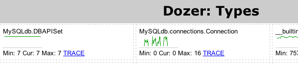

!SLIDE
# module gc #

```python
>>> import gc
>>> gc.get_threshold()
>>> gc.collect()
```

!SLIDE
# sys.getsizeof(obj)

Inclus les buffers alloués pour obj

```python
>>> import sys
>>> l = []
>>> sys.getsizeof(l)
72
```
Attention :

* Modules externes C peuvent donner des résultats faux
* Ne compte pas les objets utilisés par obj

Avoir la mémoire totale :
http://code.activestate.com/recipes/577504/

!SLIDE
# gdb-heap

https://fedorahosted.org/gdb-heap/

Langage de requête (GDB 7+ est pilotable en Python).

!SLIDE
# Meliae

https://launchpad.net/meliae

Snapshot du graphe de référence vu par le GC :

* address
* type
* __name__
* len
* value
* refs

!SLIDE
# Meliae

Dumper toutes les références dans un fichier :

```python
from meliae import scanner
scanner.dump_all_objects('filename.json')
```

!SLIDE
# Meliae

Charger un fichier et afficher un résumé :

```python
>>> from meliae import loader
>>> om = loader.load('filename.json')
>>> om.summarize()

This dumps out something like:
Total 17916 objects, 96 types, Total size = 1.5MiB (1539583 bytes)
Index   Count   %      Size   % Cum     Max Kind
   0     701   3    546460  35  35   49292 dict
   1    7138  39    414639  26  62    4858 str
   2     208   1     94016   6  68     452 type
   3    1371   7     93228   6  74      68 code
  ...
```

!SLIDE
# Meliae

Etudier le plus gros dictionnaire :

```python
>>> om.compute_referrers()
>>> dicts = om.get_all('dict')
>>> dicts[0]
dict(417338688 12583052B 1045240refs 2par)
>>> bigd = dicts[0]
>>> bigd.p
[frame(39600120 464B 23refs 1par '_get_remaining_record_stream'),
_BatchingBlockFetcher(180042960 556B 17refs 3par)]
```

!SLIDE
# memory_profiler
http://pypi.python.org/pypi/memory_profiler/

```python
@profile
def my_func():
    a = [1] * (10 ** 6)
    b = [2] * (2 * 10 ** 7)
    del b
    return a

if __name__ == '__main__':
    my_func()
```

!SLIDE
# memory_profiler

```
$ python -m memory_profiler example.py

Output will follow:

Line #    Mem usage  Increment   Line Contents
==============================================
     3                           @profile
     4      5.97 MB    0.00 MB   def my_func():
     5     13.61 MB    7.64 MB       a = [1] * (10 ** 6)
     6    166.20 MB  152.59 MB       b = [2] * (2 * 10 ** 7)
     7     13.61 MB -152.59 MB       del b
     8     13.61 MB    0.00 MB       return a
```

!SLIDE
# Pympler #
http://pypi.python.org/pypi/Pympler/

Plusieurs modules :

* pympler.classtracker / pympler.classtracker_stats / pympler.tracker	
* pympler.refbrowser / pympler.refgraph / pympler.garbagegraph
* pympler.asizeof
* pympler.muppy	
* pympler.process
* pympler.summary
* pympler.web


!SLIDE
# Module asizeof

Connaitre la taille des objets

```
pympler.asizeof.asizeof(*objs, **opts)
pympler.asizeof.basicsize(obj, **opts)
pympler.asizeof.flatsize(obj, align=0, **opts)
pympler.asizeof.leng(obj, **opts)
pympler.asizeof.refs(obj, **opts)
```

!SLIDE
# Module classtracker

Suivre une instance, classe

```
class pympler.classtracker.ClassTracker(stream=None)
  track_object(instance, name=None, resolution_level=0, 
               keep=False, trace=False)
  track_class(cls, name=None, resolution_level=0,
               keep=False, trace=False)
  start_periodic_snapshots(interval=1.0)
  create_snapshot(description='', compute_total=False)
```

!SLIDE
# Module classtracker

```python
>>> from pympler.classtracker import ClassTracker
>>> tracker = ClassTracker()
>>> obj = MyClass()
>>> tracker.track_object(obj)
>>> tracker.stats.print_summary()
```

!SLIDE
# Module classtracker

Créer des snapshots pour comparer :

```python
>>> tracker.create_snapshot('Before')
...
>>> tracker.create_snapshot('After')
```

!SLIDE
# Module classtracker

Lister les 10 plus gros objets de type Node :

```python
>>> from pympler.classtracker_stats import ConsoleStats
>>> stats = ConsoleStats()
>>> stats.load('profile.dat')
>>> stats.sort_stats('size').print_stats(limit=10,
                                         clsname='Node')
```

!SLIDE
# Module classtracker

Visualisation HTML :

```python
from pympler.classtracker_stats import HtmlStats
HtmlStats(tracker=tracker).create_html('profile.html')
```

!SLIDE
# Module classtracker 

Visualisation HTML à partir d'un fichier :

```python
from pympler.classtracker_stats import HtmlStats
stats = HtmlStats(filename='profile.dat')
stats.create_html('profile.html')
```

!SLIDE
# Module muppy

Taille des objets

```
pympler.muppy.get_objects(remove_dups=True, include_frames=False)
pympler.muppy.get_size(objects)
pympler.muppy.get_diff(left, right)
pympler.muppy.sort(objects)
pympler.muppy.filter(objects, Type=None, min=-1, max=-1)
pympler.muppy.get_referents(object, level=1)
```

!SLIDE
# Module muppy

Taille de tous les objets :

```python
>>> from pympler import muppy
>>> all_objects = muppy.get_objects()
>>> len(all_objects)                           
13552
```

!SLIDE
# Module muppy

Afficher les types :

```python
>>> import types
>>> from pympler import muppy
>>> types = muppy.filter(all_objects, Type=types.ClassType)
>>> print len(types)                                    
75
```

!SLIDE
# Module summary

Afficher un résumé

```
pympler.summary.summarize(objects)
pympler.summary.get_diff(left, right)
pympler.summary.print_(rows, limit=15,
                       sort='size', order='descending')

```
!SLIDE
# Module summary #

```python
>>> from pympler import summary
>>> sum1 = summary.summarize(all_objects)
>>> summary.print_(sum1)  

>>> sum2 = summary.summarize(muppy.get_objects())
>>> diff = summary.get_diff(sum1, sum2)
>>> summary.print_(diff)    
```

!SLIDE
# Module process #

Taille du process Python (OS)

```python
>>> from pympler.process import ProcessMemoryInfo
>>> pmi = ProcessMemoryInfo()
>>> print ("Virtual size [Byte]: " + str(pmi.vsz)) 
Virtual size [Byte]: 92864512
```

!SLIDE
# Module refgraph #

Graphe des références

```python
>>> from pympler.refgraph import ReferenceGraph
>>> a = 42
>>> b = 'spam'
>>> c = {a: b}
>>> gb = ReferenceGraph([a,b,c])
>>> gb.render('spam.eps')
True
```

!SLIDE
# Module garbagegraph #

Détecter des références circulaires 

```python
>>> from pympler.garbagegraph import GarbageGraph, start_debug_garbage
>>> start_debug_garbage()
>>> l = []
>>> l.append(l)
>>> del l
>>> gb = GarbageGraph()
>>> gb.render('garbage.eps')
True
```

!SLIDE
# Dozer #

http://pypi.python.org/pypi/Dozer

Profiler WSGI


