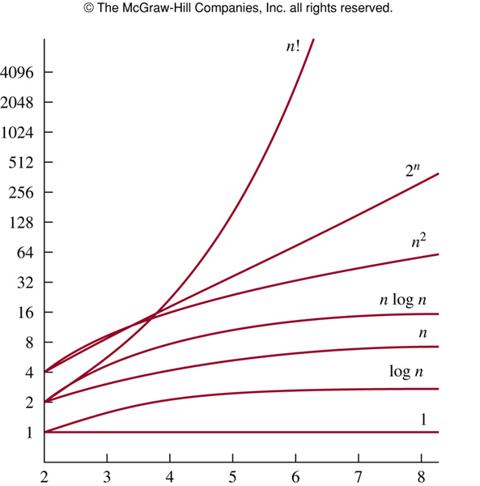

!SLIDE
# Citation

"Optimization is the root of Evil"

CAR Hoare

!SLIDE
# Raisons de lenteur

- I/O bound 
- CPU bound
- Trop d'appels
- Algo lent

!SLIDE
# Attention

Cela peut ralentir l'application

!SLIDE
# Logging

Stratégie simple :

- Mais il faut rechercher dans les logs
- Pas d'inspect
- Difficile de prévoir les besoins
- Problème de performance quand c'est verbeux

!SLIDE
# Notation Big-O 

http://en.wikipedia.org/wiki/Big_O_notation

* O(1) constant
* O(log n) logarithmique
* O(n) linéaire
* O(n log n) loglinéaire
* O(n^2) quadratique
* O(n^3) cubique
* O(k^n) exponentielle
* O(n!) factorielle

!SLIDE full

!SLIDE full

