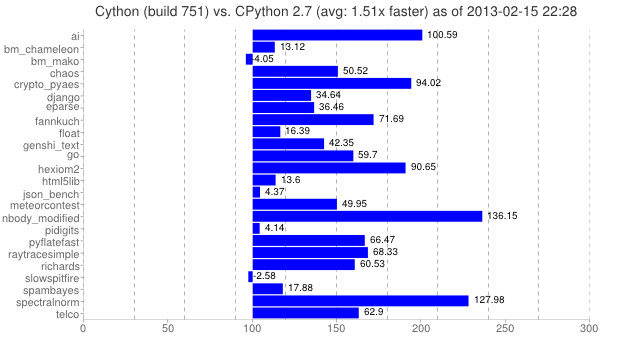

!SLIDE
# Utiliser les bonnes structures #

!SLIDE
# Implémentation naive #

```python
def fibo(n):
    if n == 0:
        return 0
    elif n == 1:
        return 1
    else:
        return fibo(n-1) + fibo(n-2)
```

!SLIDE
# Implémentation naive #

* 1 =  0.041s
* 10 = 0.054s
* 30 = 7.7s
* 50 = 137min+

Question : Compléxité Big-O ?

!SLIDE
# Implémentation efficace #

```python
def fibo2(n):
  cur, next = 0,1
  for i in xrange(n):
    (cur, next) = (next, cur+next)
  return cur
```

!SLIDE
# Implémentation efficace #

* 1 = 0.042s
* 10 = 0.044s
* 30 = 0.044s
* 50 = 0.045s
* 500 = 0.055s

Question : Compléxité Big-O ?

!SLIDE
# Python 2.7

Passage de Python 2.4 en 2.7

Vitesse : +30%

!SLIDE
# Enlever le debug

Plus de if False.

Vitesse : +20%

!SLIDE
# Module mmap

Memory-mapped file support

Vitesse : +20%

!SLIDE
# builtins #

Les fonctions builins sont rapides

!SLIDE
# Assignement multiples

```python
>>> x, y = y, x
```

!SLIDE
# Recherche avec in

```python
>>> for key in sequence:
>>>     print “found”
```

!SLIDE
# Pensez aux modules !

* itertools : combinaisons / permutations
* collections : deque, Counter, namedtuple, OrderedDict, defaultDict
* heapq : heapq
* concurrent.futures

!SLIDE 
# Local vs global

Rendre les fonctions globales locales (plus court chemin)

```python
>>> lmax = max
```

!SLIDE 
# Evitez les neested loop 

```python
>>> for x in a:
>>>     for y in b:
>>>         if x == y:
>>>             yield (x,y)

>>> return set(a) & set(b)
```

!SLIDE
# Cache interne

* Pattern memoize
* LRU (least recently used)

https://pypi.python.org/pypi/memorised
https://pypi.python.org/pypi/repoze.lru

!SLIDE
# Cache externe

- Memcached
- Redis

!SLIDE
# PyPy

6x plus rapide en moyenne

!SLIDE
# Numpy

Structure de données performantes pour le scientifique

!SLIDE
# Cython

* Intégration de code C
* Compilation de code Python vers du C


