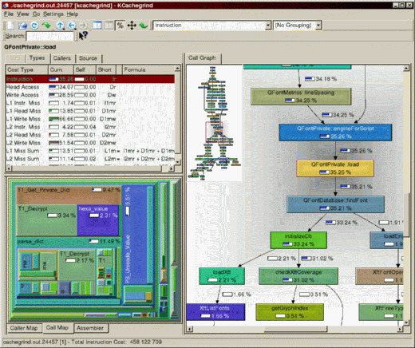
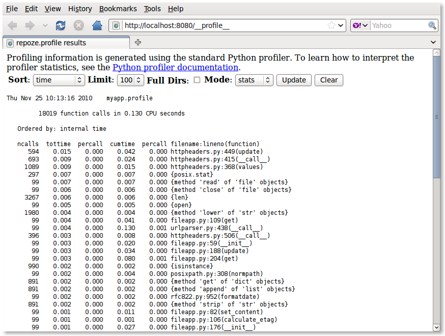
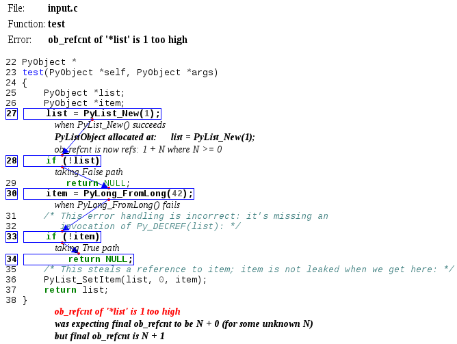
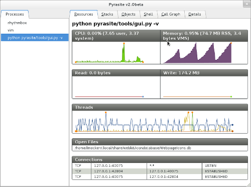

!SLIDE
# Module timeit

http://docs.python.org/2/library/timeit.html
Test de snippets de code :

```
$ python -m timeit '"-".join(str(n) for n in range(100))'
10000 loops, best of 3: 40.3 usec per loop
$ python -m timeit '"-".join([str(n) for n in range(100)])'
10000 loops, best of 3: 33.4 usec per loop
$ python -m timeit '"-".join(map(str, range(100)))'
10000 loops, best of 3: 25.2 usec per loop
```

!SLIDE
# profilehoooks

http://pypi.python.org/pypi/profilehooks

Outil simple pour profiler une fonction :

```python
from profilehooks import profile

@profile
def my_function(args, etc):
    pass
```

!SLIDE
```
$ python sample.py

*** PROFILER RESULTS ***
silly_fibonacci_example (sample.py:6)
function called 109 times

         325 function calls (5 primitive calls) in 0.004 CPU seconds

   Ordered by: internal time, call count

   ncalls  tottime  percall  cumtime  percall filename:lineno(function)
    108/2    0.001    0.000    0.004    0.002 profilehooks.py:79(<lambda>)
    108/2    0.001    0.000    0.004    0.002 profilehooks.py:131(__call__)
    109/1    0.001    0.000    0.004    0.004 sample.py:6(silly_fibonacci_example)
        0    0.000             0.000          profile:0(profiler)
```

!SLIDE 
# line_profiling #

http://pypi.python.org/pypi/line_profiler/

Outil simple pour profiler une fonction :

```python
@profile
def my_function(args, etc):
    pass

$python -m line_profiler myscript
```

!SLIDE
# PyCounters

http://pycounters.readthedocs.org/en/latest/

Compteurs utiles en production :

- Nombre de requêtes par seconde
- Temps moyen de traitement
- Temps d'attente d'une ressource
- Taux de hit d'un cache

!SLIDE
# PyCounters

Mesurer la fréquence d'utilisation :

```python
from pycounters.shortcuts import frequency

@frequency()
def f():
    pass
```

!SLIDE
# PyCounters

Mesurer le temps moyen :

```python
from pycounters.shortcuts import time

@time()
def f():
    pass
```

!SLIDE
# PyCounters

Mesurer la fréquence d'un évènement :

```python
from pycounters.shortcuts import occurrence

def f():
    if SOMETHING:
        occurrence("event_name")
```

!SLIDE
# PyCounters

Rapporter les infos :

```python
import pycounters
import logging

reporter=pycounters.reporters.LogReporter(logging.getLogger("counters"))
pycounters.register_reporter(reporter)
pycounters.start_auto_reporting(seconds=300)
```

!SLIDE
# Yappi

http://code.google.com/p/yappi/

* Profiler multi-thread
* profiling par thread (à chaud)
* Statistique pendant le profiling

```python

>>> import yappi
>>> def foo(): for i in range(10000000): pass
>>> yappi.start()
>>> foo()
>>> yappi.print_stats()
```

!SLIDE
# cProfile / pstats

http://docs.python.org/2/library/profile.html

!SLIDE
# Kcachegrind + pyprof2calltree #

Visualisation des logs profile

http://kcachegrind.sourceforge.net/html/Home.html
https://pypi.python.org/pypi/pyprof2calltree

!SLIDE
# Kcachegrind + pyprof2calltree #



!SLIDE
# gprof2dot #

https://pypi.python.org/pypi/gprof2dot


!SLIDE 
# RunSnakeRun

https://pypi.python.org/pypi/RunSnakeRun

!SLIDE full


Visualisation de logs

!SLIDE
# SnakeViz 

http://pypi.python.org/pypi/snakeviz/

Visualisation de logs

!SLIDE full


!SLIDE
# statprof #

http://pypi.python.org/pypi/statprof/

Statistique par échantillonage 

```python
import statprof

statprof.start()

try:
    my_questionable_function()

finally:
    statprof.stop()
    statprof.display()
```

!SLIDE
# repoze.profile #

http://pypi.python.org/pypi/repoze.profile

Profile WSGI

!SLIDE full



!SLIDE
# socketconsole

http://github.com/robotadam/socketconsole

Dump de la stacktrace Python

```python
import socketconsole
# Stores socket files in $TMPDIR/$TEMP/$TMP or /tmp
socketconsole.launch()
# ...or specify where to store socket file
socketconsole.launch(path='some/custom/path')
```

!SLIDE
# cpychecker

https://gcc-python-plugin.readthedocs.org/en/latest/cpychecker.html

Analyse statique de module C CPython

!SLIDE
# cpychecker



!SLIDE
# Pyrasite

http://pypi.python.org/pypi/pyrasite

Injection de code


